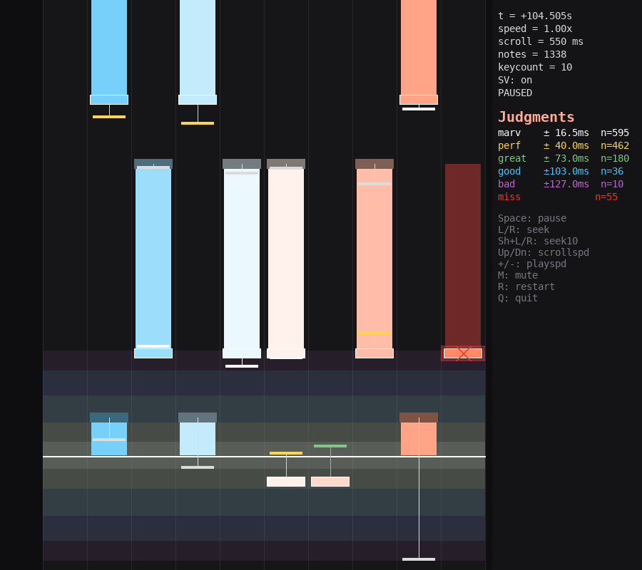
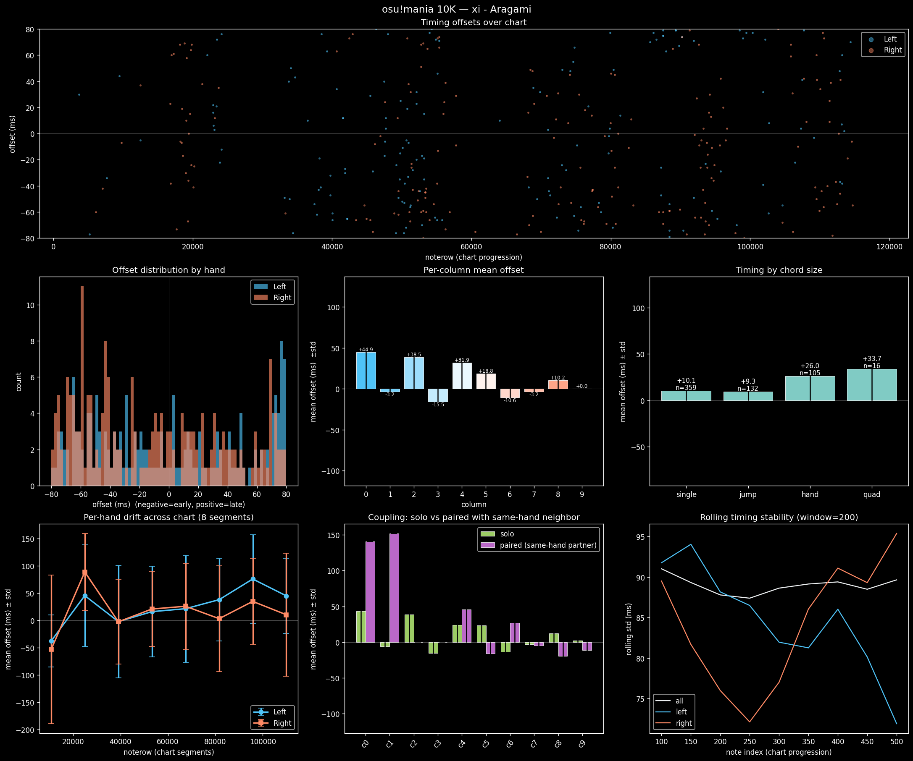

This is entirely vibecoded because I'm just making this as a side project to analyze my own gameplay and what I can change to accommodate my RSI. Though I made the clanker model some of its code based off previous work I had made. I also designed the architecture for the program and just told the clanker what to do. Specifically I told the clanker to allow user analysis plugins using python files and also to make implementation game-agnostic.

DO NOT USE THIS IN PRODUCTION SYSTEMS. I REPEAT, DO NOT USE THIS IN PRODUCTION SYSTEMS. THE CODE IS NOT VERY MODULAR AND PROBABLY HAS A TON OF BUGS FROM THE CLANKER VIBE CODING.

Use it for personal use if you want lol. I might rewrite parts by hand if really necessary, I just wanted something working rather than clean and correct.

Lemme know if the clanker somehow made a buffer overflow in python code lol

Btw I added plugins but the plugins themselves are not sandboxed. This means you should not run arbitrary plugins from randos

---

# Clanker README

A Python toolkit for offline analysis of **Etterna** and **osu!mania** replays. It reads replay files directly off disk, aligns them against the source chart, and produces timing statistics, plots, HTML reports, and a scrollable + playable replay viewer. Works with any keycount (4K, 7K, 9K, …).

## Features

- **Unified replay library** — auto-discovers Etterna profiles (`ReplaysV2` + `Etterna.xml`) and osu! installs (`Data/r/*.osr` + Songs dir), merging scores into one searchable list. First-run prompt lets you point it at custom install paths, and you can change them later from the Library tab's **Paths…** button.
- **Per-note timing analysis** — mean/std offset, judgments, hand splits, per-column drift, rolling stability, chord-size timing, coupling (solo vs paired notes).
- **Plugin visualizations** — drop a `.py` file into `visualizations/` and it shows up in the GUI automatically (see below).
- **Embedded replay player** — native Qt/QPainter chart view, with audio sync, playbar scrubbing, scroll/rate controls, swappable note skins (bar/circle), draw-stage plugins, and **SV (scroll velocity)** support for osu!mania.
- **HTML report export** — single-file self-contained summary report with all plots embedded as base64.
- **Batch mode** — run analysis across every score in a profile and produce leaderboards / cross-chart comparisons.

## Previews

Embedded replay player (osu!mania 10K):



Full-report export (osu!mania 10K — *xi - Aragami*):



## Requirements

- **Python 3.10+**
- [`numpy`](https://numpy.org/) — array math
- [`matplotlib`](https://matplotlib.org/) — plotting + report generation
- [`osrparse`](https://pypi.org/project/osrparse/) — osu! `.osr` parser
- [`PySide6`](https://pypi.org/project/PySide6/) — Qt GUI

Pitch-preserving rate changes use an in-house numpy phase vocoder — no
extra audio deps.

Install with pip:

```bash
pip install -r requirements.txt
```

### Setup from a fresh clone

The toolkit runs on Linux, macOS, and Windows. The steps are the same
everywhere — only the venv-activate command differs.

```bash
git clone https://github.com/<you>/etterna-analysis.git
cd etterna-analysis

# 1. Create a virtualenv (PySide6 + librosa are chunky — keep them isolated)
python -m venv .venv

# 2. Activate it
source .venv/bin/activate            # Linux / macOS
# .venv\Scripts\activate             # Windows (cmd)
# .venv\Scripts\Activate.ps1         # Windows (PowerShell)

# 3. Install Python deps
pip install -r requirements.txt

# 4. Launch the GUI
python -m analysis.gui.app
```

On first launch you'll be prompted for your osu! Songs folder and Etterna
Save folder — both optional, both editable later via **Library → Paths…**.

**Platform notes:**

- **Linux** — the GUI uses Qt. Most desktop distros work with the PySide6
  wheels directly; on minimal installs, add your distro's Qt/XCB runtime
  packages if the app fails to create a window.
- **macOS** — everything installs via pip directly. On Apple Silicon make
  sure you're on Python 3.11+ so the arm64 PySide6 wheels are used.
- **Windows** — no extra system deps; all wheels ship with their DLLs. Use
  the `python` launcher or `py -3.11 -m venv .venv` to pin a specific
  Python version if you have multiple installed.
- **osu!-on-Wine (Linux)** — the autodetect looks in `~/.local/share/osu-wine/`
  and the standard Lutris/Bottles paths, but if yours is elsewhere just
  point Library → Paths… at it manually.

### Optional: convenience launchers

The repo ships with a `run-gui.sh` shell script for Linux/macOS and an
`analyze` CLI entrypoint. Both call `python3` — make sure your venv is
activated, or invoke them through the venv's Python directly
(`.venv/bin/python -m analysis.gui.app` / `.venv\Scripts\python -m analysis.gui.app`).

## Running

```bash
# GUI (recommended — library browser, embedded player, all plugins)
./run-gui                                            # convenience shell script
python -m analysis.gui.app                           # direct

# CLI dispatcher (analysis without the GUI)
./analyze --help
./analyze replay /path/to/replay.osr                 # stats + plots for one replay
./analyze batch                                      # leaderboard across a profile

# Replay player standalone (Qt)
python -m analysis.player.player /path/to/replay.osr                 # osu!mania
python -m analysis.player.player /path/to/replay.bin --sm chart.sm   # Etterna
```

Settings (scroll speed, scroll mode, note skin, filter/sort choices, window
geometry, install paths) are persisted via `QSettings` and restored on next
launch — no config file to edit by hand.

### First run

On first launch you'll get a dialog asking for your **Etterna Save folder** and
**osu! Songs folder**. Both are optional:

- Leaving a field blank falls back to the usual autodetect paths (`~/.etterna/Save`,
  `~/osu!/Songs`, `~/.local/share/osu-wine/osu!/Songs`, etc.).
- Either field can be re-edited any time via **Library → Paths…**; changing it
  triggers a cache refresh so the library re-scans the new root.
- osu! replays are picked up from the `Data/r/` folder adjacent to the configured
  Songs dir, plus the default Wine/native locations.

## Testing

A pytest suite lives under [tests/](tests/). Tests run against an isolated
`XDG_CONFIG_HOME` so they don't touch your real `QSettings`.

```bash
QT_QPA_PLATFORM=offscreen python -m pytest tests/ -q
```

Currently covered: install-path overrides, validators, `find_*_dirs` override
precedence, `PathsDialog` save/clear/prefill behavior, and first-run prompt gating.

## Project layout

```
analysis/                         (Python package)
├── etterna/                      Etterna-specific parsers
│   ├── replay.py                 .bin parser + Etterna.xml score rows + save-dir discovery
│   └── sm_chart.py               .sm / .ssc parser (BPMs, offset, row→sec)
├── osu/                          osu!-specific parsers
│   └── replay.py                 .osr parser + .osu alignment + SV extraction + songs-dir discovery
├── core/                         cross-game logic
│   ├── game.py                   per-game adapter (resolve audio, chart, judgment windows)
│   ├── search.py                 unified library scan across both games
│   ├── timing.py                 per-column/hand stats, chord detection, drift, rolling std
│   └── batch.py                  leaderboard-style analysis across a profile
├── viz/                          plotting
│   ├── plots.py                  matplotlib plotters, HTML report, plot_full_report(selection=…)
│   ├── note_visualizer.py        scrollable chart renderer (used by Note Viewer plugin)
│   └── plugins/                  viz registry entry-point (delegates to analysis.plugins)
├── player/
│   ├── player.py                 replay player state/model + standalone launcher
│   ├── qt_renderer.py            native Qt/QPainter draw pipeline + plugin hook dispatch
│   ├── render_context.py         per-frame context passed to player draw plugins
│   ├── culling.py                visible-window selection for notes/holds
│   ├── plugin_api.py             public Stage enum for player draw plugins
│   ├── sidebar_api.py            sidebar-section API + SidebarContext helpers
│   ├── theme.py                  UI design tokens (proxies the active theme)
│   └── plugin_loader.py          plugin discovery, persistence, and dispatch
├── plugins/                      bundle-discovery orchestration (see plugins/README.md)
└── gui/
    ├── app.py                    PySide6 main app — library, tabs, embedded player, plot viewer
    ├── settings.py               QSettings wrapper + install-path overrides
    ├── paths_dialog.py           first-run / edit-anytime install-path prompt
    ├── library_tab.py            Library tab: score tree, filters, open-viz/player flows
    └── player_tab.py             embedded replay player tab

tests/                            pytest suite (path overrides, dialog, prompt)
analyze                           CLI entry point
run-gui                           GUI launcher script
```

## Visualization plugins

Anything dropped into [visualizations/](visualizations/) with a `register()` function is picked up on startup. Minimum contract:

```python
# visualizations/my_plot.py
from ._common import clean_arrays, new_fig

def build(replay, game='etterna', on_play=None, **_):
    rows, offs, cols = clean_arrays(replay)
    fig, ax = new_fig(10, 5)
    ax.plot(rows, offs * 1000)
    return fig  # or return a QWidget for interactive plugins

def register(add):
    add('My custom plot', build, category='chart')  # or category='widget' for QWidget
```

- `category='chart'` — `build` returns a matplotlib `Figure`; GUI wraps it in an `MplTab` with toolbar + Play button.
- `category='widget'` — `build` returns a `QWidget` (for interactive plugins like the Note Viewer or the customizable Full Report).
- Set `widget._has_play_btn = True` on your widget if you handle `on_play` yourself; otherwise the GUI will append a Play-replay bar.
- **All plugins must be keycount-agnostic.** Use helpers in [visualizations/_common.py](visualizations/_common.py) (`keycount_of(replay)`, `hand_masks(replay)`) rather than hardcoding 4K.

Current plugins: timing scatter, offset distribution, per-column means, per-hand drift, coupling, rolling stability, chord sizes, column×offset heatmap, note viewer, full report (3×3 grid with plot picker).

## Replay data format

Both parsers emit the same dict shape so everything downstream is game-agnostic:

```python
{
    'noterows':  np.int64[n],    # osu: ms; Etterna: noterows (48/beat)
    'offsets':   np.float64[n],  # seconds, signed (negative = early)
    'columns':   np.int32[n],
    'notetypes': np.int32[n],
    'misses':    np.bool_[n],
    'holds':     [(start_row, col, end_row), …],
    'keycount':  int,
    'filepath':  str,
    # osu only:
    'chart_path':   str,
    'sv_sections':  [(time_sec, sv_multiplier), …],  # empty if chart has no SV
}
```

## Replay player

Keys (when the chart view has focus):

| Key | Action |
| --- | --- |
| Space / P | pause / resume |
| Left / Right | seek ±2s (Shift for ±10s) |
| Up / Down | scroll speed |
| + / - | playback rate |
| R | restart |
| mouse wheel | seek ±0.5s (Shift for ±5s) |

Bottom controls: play/pause, playbar (click anywhere to jump), scroll ±, rate ±, restart, and **SV toggle** (osu!mania only — disabled when the chart has no SV).

## Player draw plugins

Player draw plugins work like visualization plugins: put a `.py` file in `draw_extensions/`, `player_plugins/`, `~/.config/vsrg-analysis/player_plugins/`, or any directory listed in `ETTERNA_ANALYSIS_PLAYER_PLUGINS` (separated by `:` on Linux/macOS). Each file can expose `register(add)`.

```python
# draw_extensions/receptor_flash.py
from analysis.player.plugin_api import Stage


def draw(ctx, stage):
    # ctx exposes ctx.painter for native Qt drawing, plus t_now, keycount,
    # lane geometry, candidates, visible_ghost_holds, and helpers such as
    # time_to_y()/lane_center().
    if stage != Stage.AFTER_JUDGMENT:
        return
    from PySide6.QtCore import QPointF
    from PySide6.QtGui import QColor, QPen

    ctx.painter.setPen(QPen(QColor(255, 255, 255), 1))
    for col in range(ctx.keycount):
        x = int(ctx.lane_center(col))
        y = int(ctx.judge_y)
        ctx.painter.drawEllipse(QPointF(x, y), 5, 5)


def register(add):
    add('Receptor flash', draw, stages=[Stage.AFTER_JUDGMENT], priority=100)
```

Available stages are `AFTER_LANES`, `AFTER_JUDGMENT`, `AFTER_NOTES`, `AFTER_GHOSTS`, `HUD`, and `POST_FRAME`. Lower priority runs earlier within the same stage. Plugins are normal Python code, so only install plugins you trust.

The replay player's right sidebar has a collapsible `Plugins n/m` section.
Open it to enable or disable any discovered player plugin. Disabled choices
are stored in `~/.config/vsrg-analysis/player_plugins.json`.

## Known limitations / caveats

- Etterna `.bin` offsets are quantized relative to judgment; parsing replicates the game's `GetOffset` interpretation but may disagree with in-game grade display at the edges.
- osu!mania note→press alignment is greedy-nearest within a ±188ms window. Heavily ghost-tapping scores may misattribute presses.
- At non-1x rates, pitch correction is handled by a small numpy phase vocoder. Turning pitch correction off falls back to simple resampling, so pitch shifts with rate.
- No Windows-style file lock handling for `Etterna.xml` — close the game before scanning.
- This is a personal side project. See the warning above.
